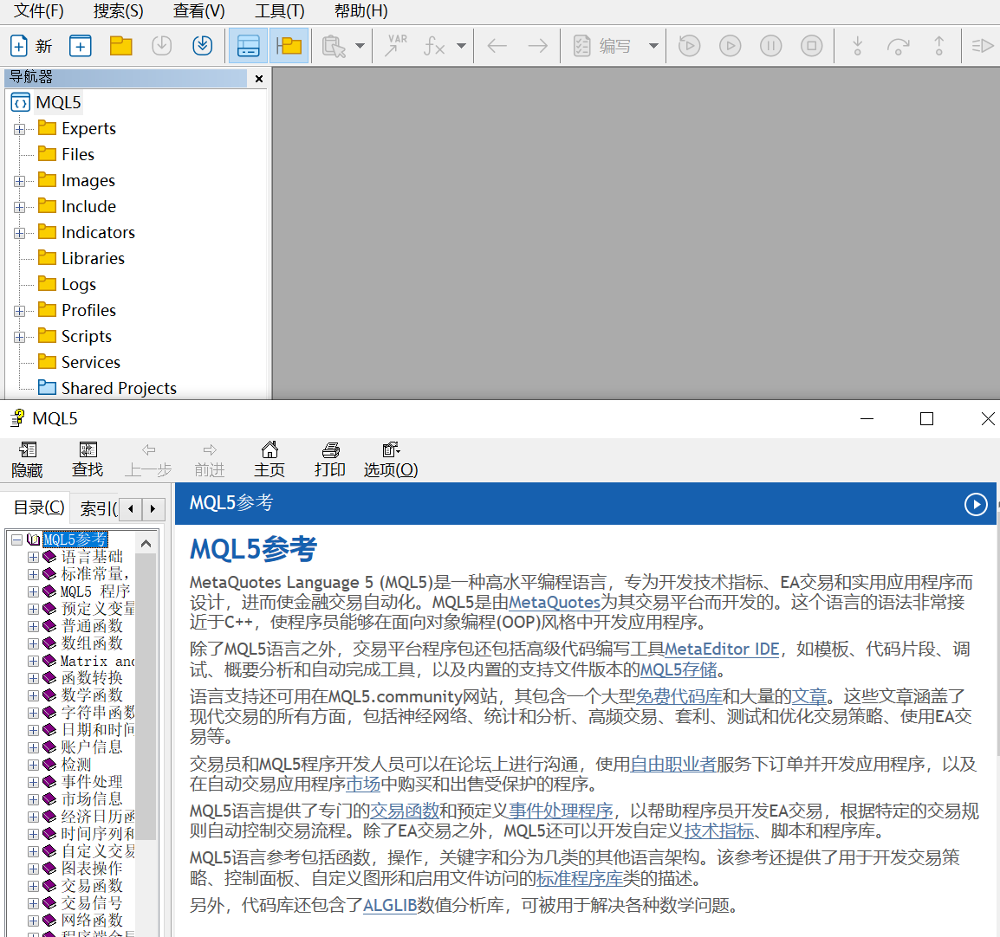
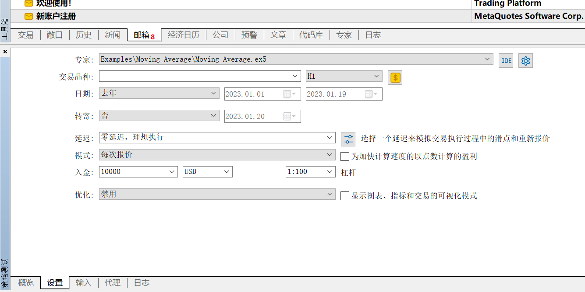
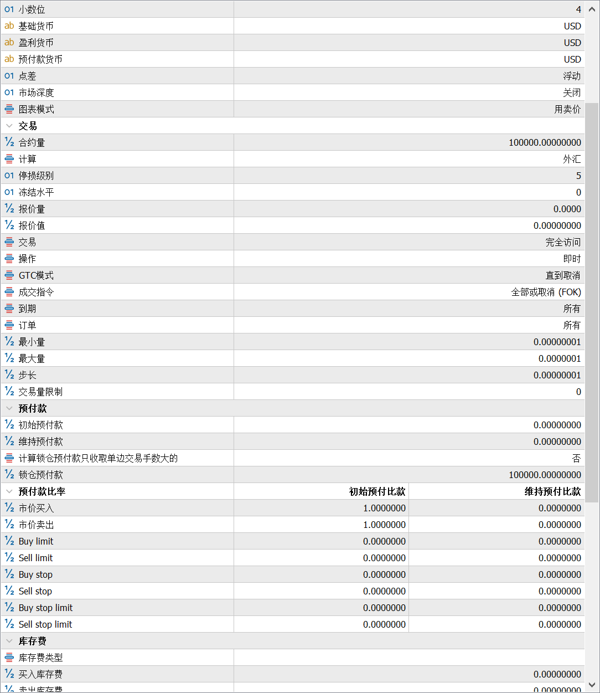
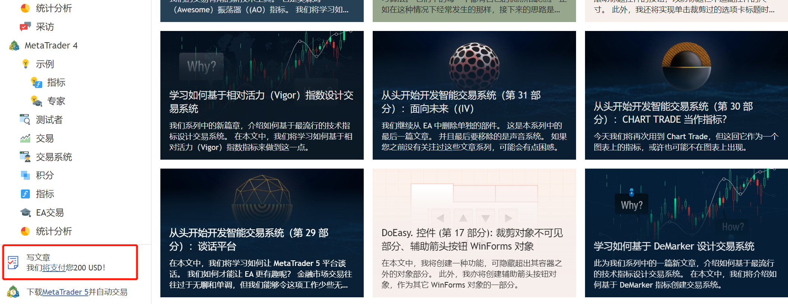

很多使用过MetaTrade软件的人都会认为它是外汇交易领域最专业的软件, 没有之一.

## 简介

MT5是MetaQuotes公司开发的一款量化交易软件, 全称**MetaTrader5**, 它的前一个版本MT4, 纵横外汇交易市场数年, 一直独领风骚, 直至今日, MetaQuotes公司推出MT5已经十余年, 仍有不少人使用MT4.

作为MT4的升级版, 实际上MT5功能要比MT4更加强大. MT5不是一个开源的项目, 但它确是可以免费使用的最好的外汇量化交易平台.

使用MT5需要下载客户端, 安装MT5时会自动安装**MetaEditor5**, 用来编辑代码. 

官网: https://www.metatrader5.com/

社区: https://www.mql5.com/zh/articles

文档: https://www.mql5.com/zh/docs

## 优势

**语言**

MT5使用mql5语言, 语法与C++十分相似, 如果你会C++, 几乎可以毫不费力上手, 而且其速度和性能也和C++不相伯仲. 

C++能做到的, mql5几乎都能做到, 想想可怕吧.

**文档**

1. 可以查阅网页版文档, 在MetaEditor5编辑代码时也能直接查阅文档.
2. 文档包括多国语言(含中文), 结构清晰, 示例多, 可以说是编程文档的典范.

**回测**

MT5可以设置不同的回测模式, 不同保证金币种和杠杆

回测时可以对品种设置极精细的保证金, 点差, 费用和持仓等, 这是笔者遇到过最专业的回测平台. 

MT5支持自定义品种, 这就意味着只要有数据, 任何品种都可以使用MT5平台做回测.

**社区**

MT5社区是笔者遇到过最专业的量化交易社区, 几乎每篇文章质量都很高, 因为每篇文章都有价值200美金的奖励.如果你有兴趣和能力, 也可以尝试在MT5社区发表文章.

**数据**

数据是做量化交易的基础, 没有数据就无法做回测, 进而就不能判断策略的好坏. 而国内的股票, 期货和期权等所有金融品种的交易数据都要收费...

使用MT5平台, 你只需要寻找一个合适的外汇经纪商(很多外汇经纪商都不靠谱), 就可以免费下载和使用Tick级的交易数据.

## 劣势

1. 因为有很多骗人的外汇交易平台都使用MT5软件, 因此MT5名声不大好.
2. MT5的客户端界面真的太丑.
3. 对Python支持不够友好, 导致很多Python机器学习相关功能不能直接使用. 当然如果编程水平足够高, 可以直接使用mq5语言编写相关模块, MT5社区已有人分享相关文章.

**最后用一句话作为文章的总结: MT5真的很强大**