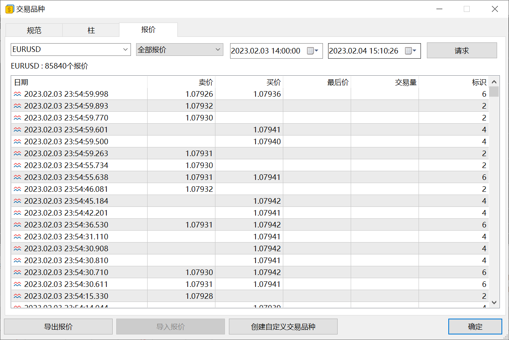
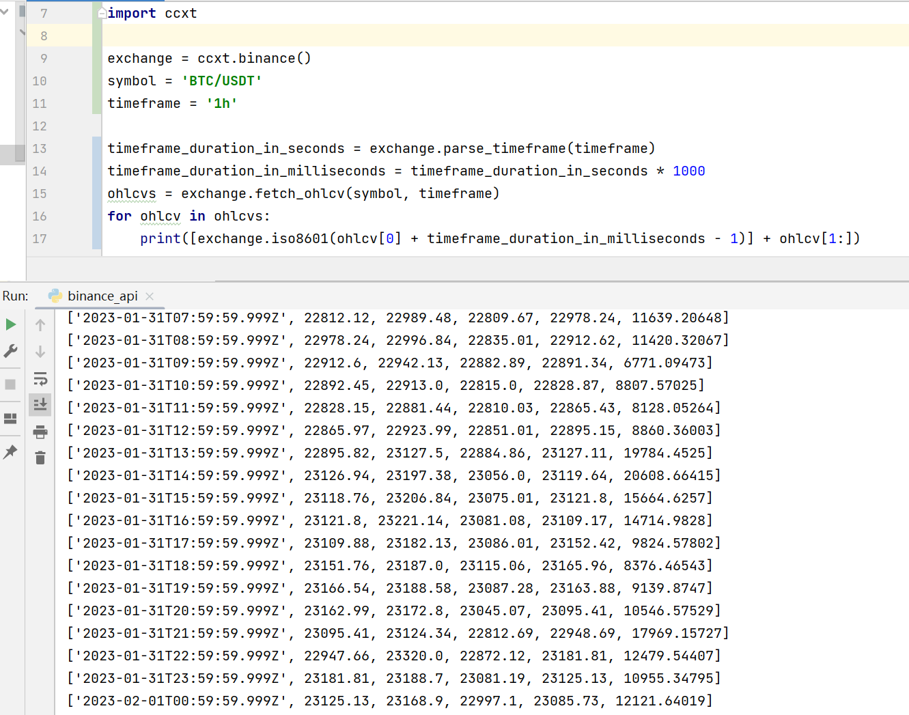
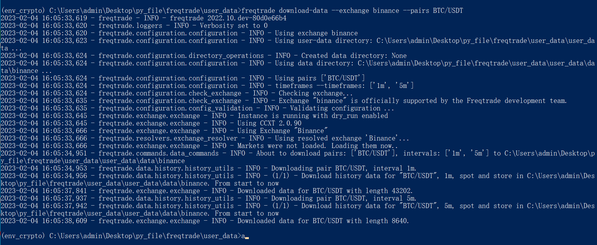

做量化交易首要解决的问题是什么?**交易数据**. 

交易数据主要分两种: K线数据(分钟和日线数据等)和Tick数据(分笔数据). 其实只要Tick数据就够了, 因为所有K线数据也都是通过Tick数据合成的. 但是Tick数据也有明显缺陷, 量太大了, 不仅处理复杂, 更关键的是做策略回测极为耗时.

国内交易品种的交易历史数据都要收费, 外汇和加密货币的数据都可以免费获取.

## 国内数据
**收费**
在国内做量化交易真是太难了, 因为几乎所有数据都要收费. 
这里是一些收费的数据源介绍: https://www.vnpy.com/docs/cn/datafeed.html

**免费**
Github上有一个获取免费数据的项目: https://github.com/Micro-sheep/efinance
以商品期货为例, 它只能下载1天的1分钟数据, 很明显, 它并不能满足一般需求.

**其他方案**
1. 自己接收实时行情数据并保存(难度大, 且没有历史数据)
2. 向熟人要一些历史数据.
3. 一些收费数据源有免费试用期.
4. 进入一家有交易数据的公司上班(善于利用公司资源).

## 数据下载和保存

#### VeighNa
如果购买了VeighNa官方推荐的数据源, 可以直接通过客户端或脚本下载数据, 自动保存, 极为方便. (数据服务文档: https://www.vnpy.com/docs/cn/datafeed.html)

如果是自己通过其他渠道获取的数据则需要自己手动处理并保存为指定格式, 参考: https://dumengru.com/docs_vnpy/03%E7%A4%BA%E4%BE%8B%E6%BC%94%E7%A4%BA/03%E6%95%B0%E6%8D%AE%E5%A4%84%E7%90%86/

#### WonderTrader
WonderTrader处理历史数据较为复杂, 参考: https://dumengru.com/docs_wonder/03%E5%9B%9E%E6%B5%8B%E8%BF%9B%E9%98%B6/01%E5%89%8D%E8%A8%80/

#### MT5
登录自己的经纪商账户, 自动有Tick级数据, 将来做策略回测和研究简直不要太方便.

值得注意的是, 外汇由于其特殊性, 不同经纪商提供的历史数据都不一样, 为了保证将来实盘一致性, 建议始终使用我们将来计划实盘交易的账户的历史数据.(尤其不建议使用MT5自带的模拟账户提供的历史数据, 因为它的买卖点差太小, 和一般经纪商实盘提供的点差有差异)

#### CCXT
在加密货币领域, 能获取哪些历史数据和CCXT无关, 和我们开户的交易所有关.

#### FreqTrade
FreqTrade直接使用一句命令便可以下载数据

## 数据问题
#### K线合成
如果能有Tick数据, 自然是最好的, 但是如果我们使用K线数据, 就需要注意K线数据的合成方式.

以1分钟K线为例, 假设9:00至9:01这一分钟有30笔交易, 我们统计出高开低收价格之后, 时间戳应该算9:00还是9:01呢? 很不幸, 这个问题并没有统一答案, 因此我们需要留意. 

#### 未来函数
上一个问题, 在一般情况下, 都会选择9:00作为时间戳. 因此在回测过程中, 需要注意避免未来函数. 

想象一下, 在回放历史数据的时候, 假设回放9:00的一分钟K线, 而这根K线所包含的高开低收价是9:00至9:01之间的. 但是实际交易中, 我们在9:00并不可能得到9:00至9:01之间的高开低收价. 

如果我们在回测中使用了未来数据, 回测结果肯定是错误的.

**最后用一句话作为文章的总结: 千里之行, 始于足下**

